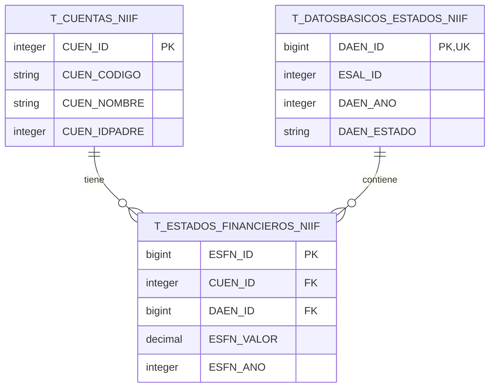
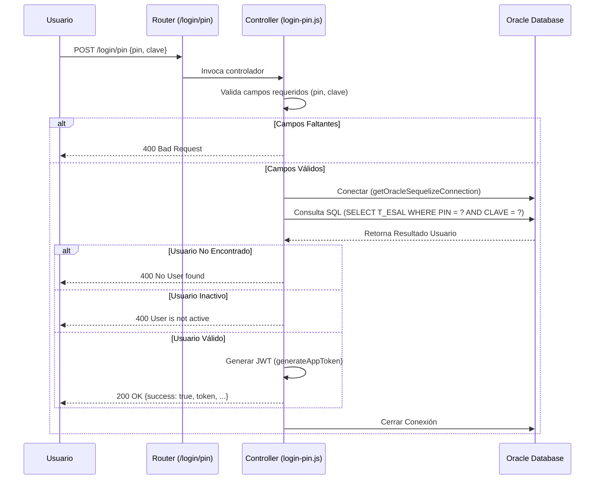

# Documento de Diseño Técnico - back-ivc-suc-virtual

## 1. Arquitectura del Sistema

El sistema sigue una arquitectura de tres capas: Cliente, Servidor de Aplicaciones (Backend API), y Servidor de Base de Datos.

```mermaid
graph TD
    Client[Cliente (Frontend/Postman)] -->|HTTP Requests| API[Backend API (Node.js/Express)]
    API -->|SQL Queries via Sequelize| DB[(Oracle Database)]
    DB -->|Result Sets| API
    API -->|JSON Responses| Client

    subgraph "Backend Components"
    API
    Auth[Módulo de Autenticación]
    Controllers[Controladores]
    Models[Modelos Sequelize]
    end
```

## 2. Diagrama de Entidad-Relación (ERD)

Representación de las principales tablas relacionadas con la gestión de estados financieros NIIF.



## 3. Diagrama de Secuencia - Autenticación (Login)

Flujo de proceso para el endpoint `POST /login/pin`.



## 4. Descripción de Componentes

### 4.1 Controladores (`src/controllers`)
Manejan la lógica de negocio para cada ruta.
- **Login Pin**: Valida credenciales contra la tabla `T_ESAL` utilizando consultas directas o modelos, y emite un token JWT si la autenticación es exitosa.

### 4.2 Middlewares (`src/middlewares`)
Funciones que se ejecutan antes del controlador final.
- **CORS**: Habilita el acceso desde diferentes orígenes.
- **Request Logger**: Registra información básica de cada petición entrante.
- **JWT Sign**: Utilidad para firmar tokens JWT seguros.

### 4.3 Sequelize y Base de Datos (`src/sequelize`)
- **`getOracleSequelizeConnection`**: Gestiona la conexión a la base de datos Oracle, incluyendo la inicialización del cliente de Oracle y la configuración del pool de conexiones.
- **Modelos**: Abstracción de las tablas de la base de datos para facilitar las operaciones CRUD.

### 4.4 Utilidades (`src/util`)
Funciones de ayuda transversal.
- **Logger**: Sistema de registro de eventos (Pino).
- **Encrypt**: Funciones criptográficas para manejo de claves.
